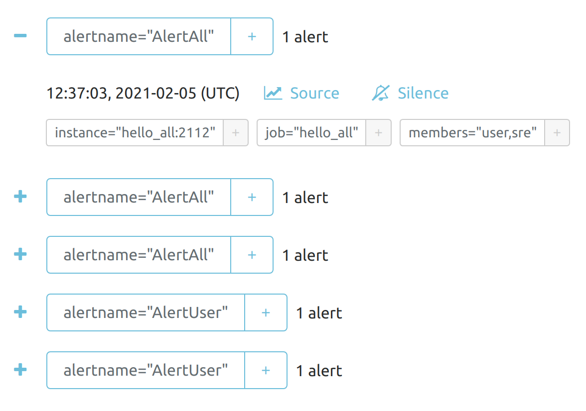

# Alertmanager Playground

In this playground, a Prometheus [Alertmanager](https://github.com/prometheus/alertmanager) handles alerts thrown by a running Prometheus instance. The Alertmanager in this example is configured with one alert (specified in an [`alert.rules`](./prometheus/alert.rules) file) that Prometheus fires whenever services `hello_all`, `hello_user` and `hello_sre` of the same [`hello`](./hello/main.go) app—a simple web app—are down for more than 10 seconds. If Prometheus alerts the Alertmanager that any `hello_*` service is down, it will selectivity `POST` webhooks to the [`webhook_*`](./webhook/main.go) services—`webhook_sre`, `webhook_user` and `webhook_admin`, which will then log the alert sent by the Alertmanager to stdout.

## Prerequisites

[Docker](https://docker.com) and [Docker Compose](https://docs.docker.com/compose/).

## Usage

To start the playground:

```bash
make run # docker-compose up --build
```

This will start up 4 kinds of services:

Service | Description
:-------|:-----------
`prometheus` | A Prometheus instance that's [configured](./prometheus/alert.rules) to alert the Alertmanager whenever the `hello_*` web service has been down for more than 10 seconds
`alertmanager` | An Alertmanager instance that's configured to `POST` an alert message to the `webhook` service whenever Prometheus alerts Alertmanager that the `hello_*` service is down
`hello_*` | Instantiated from a simple [web app](./hello/main.go) written in Go. The `hello` web app has just two endpoints: a `/hello` endpoint that returns a `{"hello":"world"}` JSON object and a `/metrics` endpoint for Prometheus instrumentation
`webhook_*` | Instantiated from a simple [web service](./webhook/main.go) written in Go. The `webhook` web service has just one `/alert` endpoint to which Alertmanager alerts are `POST`ed

## Creating Alerts

When you first start up the containers, there's no alert-worthy behavior because the `hello_*` services are running as expected. You can verify this in the [Prometheus expression browser](http://localhost:9090/graph) using the [`up{job=~"hello_.*"}`](http://localhost:9090/graph?g0.expr=up%7Bjob%3D~%22hello_.*%22%7D&g0.tab=1&g0.stacked=0&g0.range_input=1h) expression, which should have values of 1.

### Alert All Receivers

To create alerts to `webhook_user`, `webhook_sre` and `webhook_admin`, stop the service `hello_all`:

```bash
docker-compose stop hello_all
```

According to [the alert rule](./prometheus/alert.rules):

```
  - alert: AlertAll
    expr: up{job="hello_all"} == 0
    for: 10s
    labels:
      members: "user,sre"
```

and the related [alert manager configuration](./alertmanager/alertmanager.yml):

```
  routes:
  - receiver: webhook_user
    continue: true
    match_re:
      members: .*user.*

  - receiver: webhook_sre
    continue: true
    match_re:
      members: .*sre.*

  - receiver: webhook_admin
```

all receivers, i.e. `webhook_user`, `webhook_sre` and `webhook_admin`, will be matched and notified. Wait about 10 seconds and you should see something like this in the Docker Compose logs:

```
alertmanager_playground_hello_all_1 exited with code 2
webhook_user_1     | 2021/02/05 12:37:13 Webhook [webhook_user:5001] received: /* omitted */
webhook_admin_1    | 2021/02/05 12:37:13 Webhook [webhook_admin:5001] received: /* omitted */
webhook_sre_1      | 2021/02/05 12:37:13 Webhook [webhook_sre:5001] received: /* omitted */
```

### Alert Partial Receivers

To create alerts only to `webhook_user` and `webhook_admin`, stop the service `hello_user`:

```bash
docker-compose stop hello_user
```

According to [the alert rule](./prometheus/alert.rules) and the [alert manager configuration](./alertmanager/alertmanager.yml):

```
# In prometheus/alert.rules:

  - alert: AlertUser
    expr: up{job="hello_user"} == 0
    for: 10s
    labels:
      members: "user"


# In alertmanager/alertmanager.yml:

  routes:
  - receiver: webhook_user
    continue: true
    match_re:
      members: .*user.*

  - receiver: webhook_sre
    continue: true
    match_re:
      members: .*sre.*

  - receiver: webhook_admin
```

`webhook_user` and `webhook_admin` will be notified. Wait about 10 seconds and you should see something like this in the Docker Compose logs:

```
alertmanager_playground_hello_user_1 exited with code 2
webhook_admin_1    | 2021/02/05 12:40:13 Webhook [webhook_admin:5001] received: /* omitted */
webhook_user_1     | 2021/02/05 12:40:13 Webhook [webhook_user:5001] received: /* omitted */
```

You can also see the alert in the [Alertmanager UI](http://localhost:9093/#/alerts). It should look like this:



In the Prometheus expression browser, [`up{job=~"hello_.*"}`](http://localhost:9090/graph?g0.expr=up%7Bjob%3D~%22hello_.*%22%7D&g0.tab=1&g0.stacked=0&g0.range_input=1h) should now have two values of 0 and one value of 1.


To clean up the playground:

```bash
make stop # docker-compose down
```